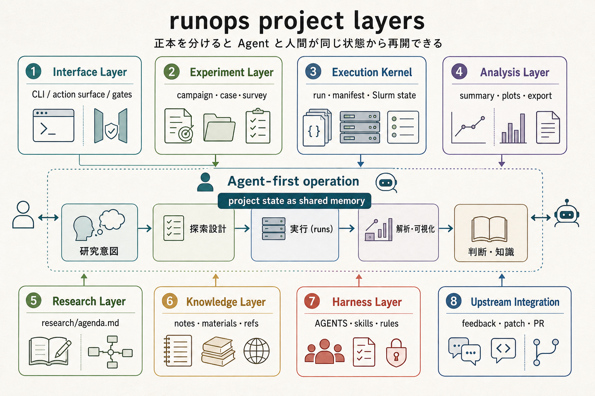

# Project State Layers

このページは、runops project の「何をどこに置くか」を調べるための索引です。
実装 module の説明は [アーキテクチャ](../architecture.md) を参照してください。

## 全体像



```text
研究意図 -> bounded Experiment -> lazy候補 -> selected Run -> 解析 -> Result / 判断
```

各 Layer は、正本、生成物、更新方法が異なる project 運用上の境界です。

| Layer | 正本・主な対象 | 文書 |
|---|---|---|
| Interface | CLI、action、MCP、human gate | [interface.md](interface.md) |
| Experiment | `campaign.toml`、`experiments/*.toml`、`case.toml`、lazy `survey.toml` | [experiment.md](experiment.md) |
| Execution Kernel | Run、TestAttempt、`manifest.toml`、submit、sync、provenance | [execution-kernel.md](execution-kernel.md) |
| Analysis | run-local 解析、survey 集計、cross-run 比較 | [analysis.md](analysis.md) |
| Research | `CURRENT.md`、journal、残す result | [research.md](research.md) |
| Knowledge | plugin、materials、facts、insights、refs | [knowledge.md](knowledge.md) |
| Harness | `AGENTS.md`、`CLAUDE.md`、skills、rules | [harness.md](harness.md) |
| Upstream Integration | feedback、local patch、issue、PR | [upstream.md](upstream.md) |

## 迷ったときの判断

- 一つの問い・budget・exitなら Experiment、実験条件を再利用するなら Case / Survey。
- smoke / debugなら正式 Run ではなく TestAttempt。
- 1 回の実行状態や由来なら Execution Kernel。
- 計算から直接得た図や集計なら Analysis。
- 複数の evidence から得た判断なら Research。
- 複数 project で再利用する小さな知見なら Knowledge。
- Agent の権限や定型手順なら Harness。
- runops 本体へ返す変更なら Upstream Integration。

Interface は各 Layer を操作する入口です。`runo lint` は Layer を横断して project state を
検査します。詳細は [Project Health Check](../project-health.md) を参照してください。

## Product context との対応

| Product context | 関係する Layer |
|---|---|
| Execution Kernel | Experiment、Execution Kernel |
| Research Workspace | Analysis、Research、Knowledge |
| Agent Gateway | Interface、Harness |
| Operator / Developer utilities | Upstream Integration、operator utilities |

project-state migration は [Migration Guide](../migrations/README.md) を参照してください。
